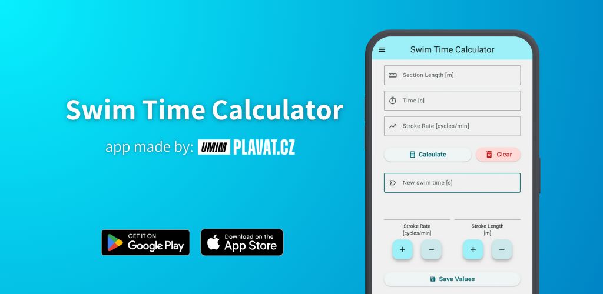
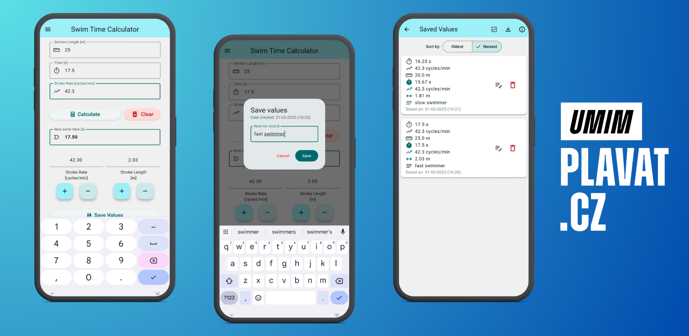

# Swim Time Calculator

This app calculates how potential changes in two key performance parameters - **stroke rate (_SR_)** and **stroke length (_SL_)** - affect the average clean swim time.
**Swimming speed (_V_)** results from the optimal balance between **SR** and **SL** (_V = SR * SL_).

Users can adjust **SR** and **SL** values to estimate potential average changes in clean swim time. The app calculates a new swim time by varying one parameter (e.g., increasing SR) while keeping the other constant, or by varying both parameters.
This helps swimmers better understand how even small adjustments in **SR** or **SL** can significantly impact their swim times.

  

If you download the app from the mobile stores mentioned above and you like it, please leave us a review on the store. If you encounter any problems or have a suggestion for a new feature, feel free to email <a href="mailto:marek@umimplavat.cz">email</a> us.

## How our app looks like?

  

## About the idea
**Original idea:** Raul Arellano

**Author:** [umimplavat.cz](https://umimplavat.cz/)

**Creator:** [Vojtech Netrh](https://github.com/Nert53)

## Versions changelog 
#### v3.0.2 (last version)
- Added feature dialog
- Fixed bugs

  
View all versions

  #### v3.0.1 (last version)
  - Added split home screen UI for iPad
  - Improved button layout
  - Updated packages
  
  #### v2.1.2
  - Improved animations
  - Fixed bugs
  
  #### v2.1.1
  - Improved export.
  
  #### v2.1.0
  - Added option to export database to CSV.
  - Added "rate the app" button.
  
  #### v2.0.3
  - Shortened name displayed on home screen.
  - Prettier icons in "saved values" screen.
  
  #### v2.0.2
  - Added link to privacy policy.
  - Small UI changes.
  
  #### v2.0.0
  - Export saved data to PDF.
  - UI changes.
  
  #### v1.1.3
  - Fixed bug with saving decimal values.
  - Added undo feature for deleting values.
  
  #### v1.1.2
  - Fixed bug with no possibility of entering decimal numbers.
  
  #### v1.1.0
  - Initial version

## Technical Support Contant
If you have any questions please contact us on marek@umimplavat.cz or umimplavat@gmail.com.

## Want to support us? 🤝🏻

 If you would like to support us please reach <a href="mailto:marek@umimplavat.cz">Marek Polach</a>.
 And you can definitely give ⭐️ to this repo.
